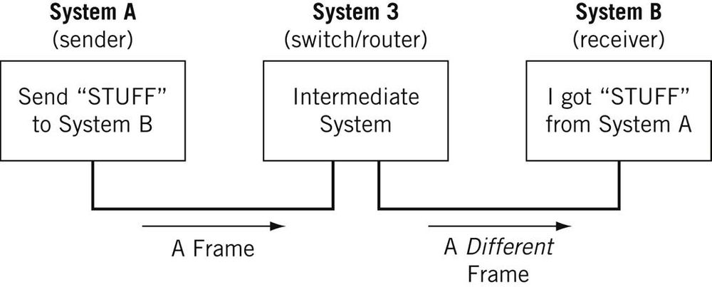
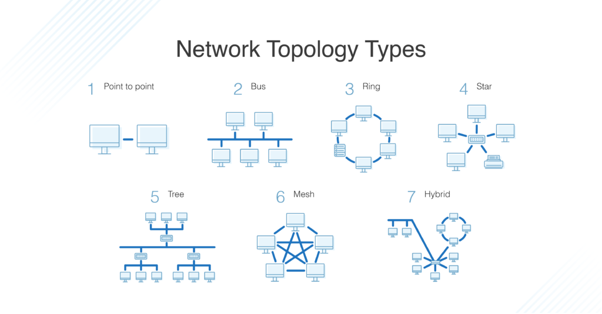

# OSL Model

## Definitions

- Nodes : physical electronic device linked to a network, it can be a computer or printer etc... 
It is capable of sending and/or receiving information over a network. Nodes can be connected directly or there may be an intermediate node. 
Host is another term that you will encounter in networking. I will define a host as a type of node that requires an IP address. All hosts are nodes, but not all nodes are hosts.

- Links : Links connect nodes on a network. Links can be wired, like Ethernet, or cable-free, like WiFi. 
Links to can either be point-to-point, where Node A is connected to Node B, or multi-point, where Node A is connected to Node B and Node C. 
When we’re talking about information being transmitted, this may also be described as a one-to-one vs. a one-to-many relationship.

- Protocol : set of rules that allows two nodes on a network to exchange data.

- Networks : A network is a general term for a group of computers, printers, or any other device that wants to share data.

- Topology : describes how nodes and links fit together in a network configuration, often depicted in a diagram.

